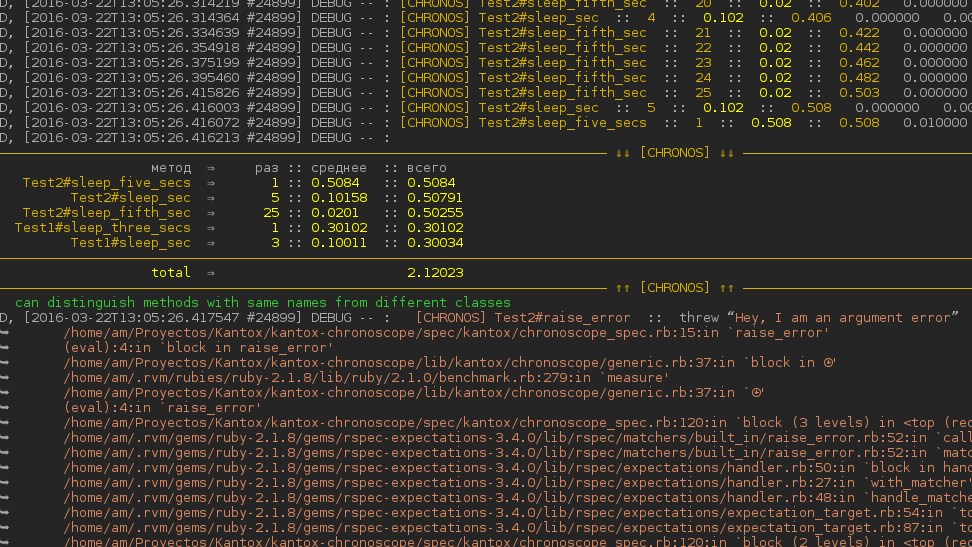

# Kantox::Chronoscope

[](https://travis-ci.org/am-kantox/kantox-chronoscope)

`Chronoscope` is designed for those, who has not enough foresight and starts
benchmarking/profiling their applications when everything already is terrible.

On the other hand, `Chronoscope` is a lightweight solution, that permits
to plug in benchmarks for virtually everything in a matter of seconds.

It just works out of the box: no modifications of application code is required.
It permits benchmarking in production as well, though it is not recommended. The
total impact on productivity is proven to be less that 1%.

## Installation

Add this line to your application's Gemfile:

```ruby
gem 'kantox-chronoscope'
```

And then execute:

    $ bundle

Or install it yourself as:

    $ gem install kantox-chronoscope

## Usage

1. Create the configuration file in `config/chronoscope.yml`:

```yaml
general:
  handler: 'Kantox::Chronoscope::Generic'
  enable: true

options:
  silent: true

i18n:
  name: метод
  times: раз
  average: среднее
  total: всего
```

2. Attach `Chronoscope` to one or more targets:

```ruby
Kantox::Chronoscope.attach(Order) # all methods of Order
Kantox::Chronoscope.attach(User, :login) #    User#login
```

And somewhere in the execution end (e. g. when used with `Rails`, this goes into
`spec/spec_helper.rb`):

```ruby
config.after(:suite) do
  benchmarks = ⌛(cleanup: true)
end
```

3. Get the following output:



Here `silent` options is set to `false`, that’s why we see logs from each subsequent
call to monitored function.

4. After execution, the result tree (with call hierarchy) is returned as:

```ruby
puts '—'*($stdin.winsize.last rescue 80)
puts benchmarks[:data].inspect
puts '—'*($stdin.winsize.last rescue 80)
#⇒ {"Hedge#send_email_on_create"=>{:count=>26, :total=>0.00013026800000000003, :stack=>[]},
#   "Hedge#send_email_on_create="=>{:count=>11, :total=>4.066e-05, :stack=>[]},
#   "Hedge#hedge_type"=>{:count=>188, :total=>0.0024204860000000003, :stack=>[]} ...
```

## Development

After checking out the repo, run `bin/setup` to install dependencies. Then, run `rake spec` to run the tests. You can also run `bin/console` for an interactive prompt that will allow you to experiment.

To install this gem onto your local machine, run `bundle exec rake install`. To release a new version, update the version number in `version.rb`, and then run `bundle exec rake release`, which will create a git tag for the version, push git commits and tags, and push the `.gem` file to [rubygems.org](https://rubygems.org).

## Contributing

Bug reports and pull requests are welcome on GitHub at https://github.com/[USERNAME]/kantox-chronoscope. This project is intended to be a safe, welcoming space for collaboration, and contributors are expected to adhere to the [Contributor Covenant](contributor-covenant.org) code of conduct.


## License

The gem is available as open source under the terms of the [MIT License](http://opensource.org/licenses/MIT).
